<h1 align="center">
  지식 관리 시스템
  <br />
   <a href="https://www.meetup.com/Angular-Medellin/">
    
  </a> 
  <br />
  
</h1>
<h3 align="center">협업의 새로운 차원</h3>


<h2> COCONOTE 바로가기 </h2>
   <a href="https://www.coconote.site">https://www.coconote.site</a>


<h2> ️💚️ TEAM 💚 </h2>

<!-- ALL-CONTRIBUTORS-LIST:START - Do not remove or modify this section -->
<!-- prettier-ignore -->
| [<br /><sub><b>김정은</b></sub>](https://github.com/ara-ro)<br />        | [<br /><sub><b>김민지 </b></sub>](https://github.com/p1p3)<br /> | [<br /><sub><b>김지호</b></sub>](https://github.com/danielcb29)<br /> | [<br /><sub><b>전상민</b></sub>](http://co.linkedin.com/in/alejandronanez/)<br /> |          [<br /><sub><b>최세호</b></sub>](https://github.com/MelinaMejia95)<br /> |                             
| :-----------------------------------------------------------------------------------------------------------------------------------------------------------------: | :-----------------------------------------------------------------------------------------------------------------------------------------------------------------------: | :-------------------------------------------------------------------------------------------------------------------------------------------------------------------: | :-------------------------------------------------------------------------------------------------------------------------------------------------------------: | :------------------------------------------------------------------------------------------------------------------------------------------------------------: | 
<!-- ALL-CONTRIBUTORS-LIST:END -->
<br /><br />

## ❤️ 목차

1. [프로젝트 소개](#소개)
2. [기획](#기획)
3. [기술 스택](#기술-스택)
4. [개발](#개발)
   - [백엔드 API 요청 및 응답 (Swagger)](#백엔드-api-요청-및-응답-swagger)
   - [프론트엔드 기능 시연](#프론트엔드-기능-시연)
5. [구조 및 아키텍처](#구조-및-아키텍처)
6. [배포](#배포)
7. [테스트](#테스트)
<br /><br />

<h2 id="프로젝트-소개"> 🧡 프로젝트 소개 </h2>
<h3> 개요 </h3>
COCONOTE는 노션의 문서 관리와 슬랙의 실시간 커뮤니케이션을 하나로 통합한 지식 공유 및 관리 플랫폼입니다.

<h3> 배경 및 목적 </h3>

  - COCONOTE는 기업에서 팀 프로젝트를 진행할 때 필요한 협업 도구들을 하나로 통합해보는것은 어떨까? 하는 생각에서 나왔습니다.
  - 효율적이고 체계적인 지식의 통합 관리 및 공유
  - 실시간 채팅을 통한 자유로운 커뮤니케이션과 팀원들 간의 협업 효울성의 극대화
  - 드래그 앤 드롭을 통한 다양한 형식의 파일의 직관적인 공유 방식
  - 여러 협업 도구들 간의 이동으로 인한 개발자의 번거로움과 피로감 경감

<h3> 프로그램 사양서 </h3>

- SNS를 통한 간편 로그인
- workspace 를 통한 section, channel 생성
  - 공개, 비공개 채널을 통한 참가자 제한
  - 초대를 통한 참가자 추가
- channel 별로 구분되어있는 **쓰레드**```(채팅)```, **캔버스**```(노션)```, **드라이브**```(네이버 or 구글 드라이브) ```
- 쓰레드
  - 단체 채팅, 이미지를 통한 정보공유
- 캔버스
  - 단체 문서수정, 유저별로 실시간 동기화 되어있는 문서
- 드라이브
  - 채널 내부의 쓰레드, 캔버스 자동업로드
  - 드라이브 내 파일 업로드를 통한 쓰레드, 캔버스 파일 동기화 기능
<br /><br />

---

<h2 id="기획"> 💛 기획 </h2>

<h3> WBS </h3>

[<b> WBS 보러가기 ➡️</b>](https://docs.google.com/spreadsheets/d/1-55RJo0awEfJTcGI6TlrkOE9e4nGFYGOgi4ZCOvZu58/edit?usp=sharing)

<h3> 요구사항 정의서 </h3>

[<b>요구사항 정의서 보러가기 ➡️</b>](https://docs.google.com/spreadsheets/d/e/2PACX-1vRFFDDVRpsGfdgAvZc17fByKMgOEAG-cOA_VBWJCR53_YVacTATFazxp7AeO5hKaCS26RYA9g2NXL-b/pubhtml)

<h3> ERD </h3>

[<b>ERD 보러가기 ➡️</b>](https://www.erdcloud.com/d/9kcavurSDGPf2B6mr)

<h3> 화면설계서 (FIGMA) </h3>

[<b>화면설계서 보러가기 ➡️</b>](https://www.figma.com/design/SBzlObD1tMe49ZCXRpzyTx/COCONOTE---%ED%99%94%EB%A9%B4%EC%84%A4%EA%B3%84?node-id=0-1&t=O8uikTbKJRUR5e9g-1)

<h3> API 명세서 </h3>

[<b>API 명세서 보러가기 ➡️</b>](https://ara-boka.notion.site/COCONOTE-API-11585d64912780a3ac04f2305aed6349?pvs=4)
<br /><br />

<h2 id="기술-스택"> ️🛠️ 기술 스택 </h2>

### Backend  
### Frontend    
### DB  

### CI/CD 

### Etc 

### Communication     
<br /><br />

<h2 id="개발"> 💻 개발 </h2>
<h3 id="백엔드-api-요청-및-응답-swagger"> 백엔드 API 요청 및 응답 (Swagger) </h3>

<h3 id="프론트엔드-기능-시연"> 프론트엔드 기능 시연 </h3>
<details>
  <summary>회원</summary>

- 로그인  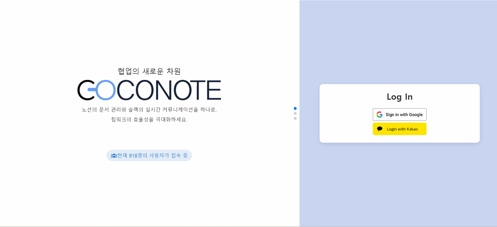
- 로그아웃  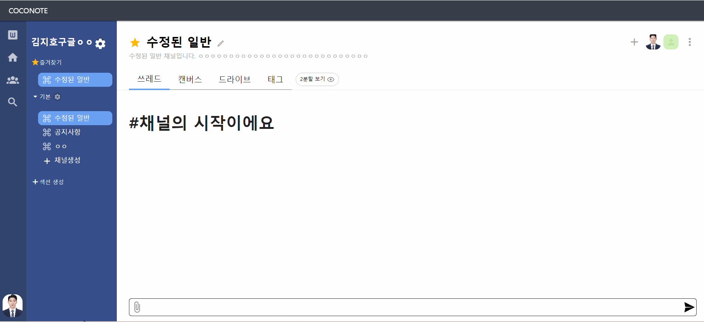
</details>

<details>
  <summary>워크스페이스</summary>

- 워크스페이스 생성 
- 워크스페이스 정보 수정 
- 워크스페이스 선택 및 이동 
- 워크스페이스삭제 
- 워크스페이스 내에서 나의 프로필 조회 및 변경 
- 워크스페이에 새로운 멤버 초대 
- 워크스페이스 멤버 조회 및 권한 변경 
- 워크스페이스 멤버 강퇴 
</details>

<details>
  <summary>섹션</summary>

- 섹션 생성 
- 섹션 삭제 
- 섹션 정보 수정 
- 즐겨찾기 
</details>

<details>
  <summary>채널</summary>

- 채널 공개 및 비공개 수정 
- 채널 멤버의 권한 변경 
- 채널 생성 
- 채널 가입 
- 채널 삭제 
- 채널 멤버 강퇴 
- 채널 탈퇴 
- 워크스페이스 멤버 내에서 채널 멤보 초대 
- 채널 정보 수정 
</details>

<details>
  <summary>스레드</summary>

- 스레드 생성 
- 스레드 수정 
- 스레드 삭제 
- 파일 업로드 
- 댓글 
- 스크롤 페이지네이션 
</details>

<details>
  <summary>태그</summary>

- 생성 및 추가 
- 태그 검색 
- 태그 수정 
- 태그 삭제 
- 태그 붙이기 
- 태그 떼어내기 
</details>

<details>
  <summary>캔버스</summary>

- 페이지 생성 
- 캔버스 작성 
- 이미지 업로드 
- H 템플릿 
- 그 외 템플릿 
- 드래그 앤 드랍으로 순서 변경 
- 캔버스 삭제 
</details>

<details>
  <summary>드라이브</summary>

- 새 폴더 생성 
- 폴더 이름 변경 
- 파일 올리기 
- 파일 이름 변경 
- 파일 및 폴더 삭제 
- 드래그 앤 드랍 파일 이동 
</details>

<details>
  <summary>2분할</summary>

  - 이분할 열고 닫기 
  - 이분할 화면에서 쓰레드와 캔버스 작성 
  - 드라이브에서 쓰레드로 파일 업로드 
  
</details>

<h3>기능별 플로우</h3>
    로그인
    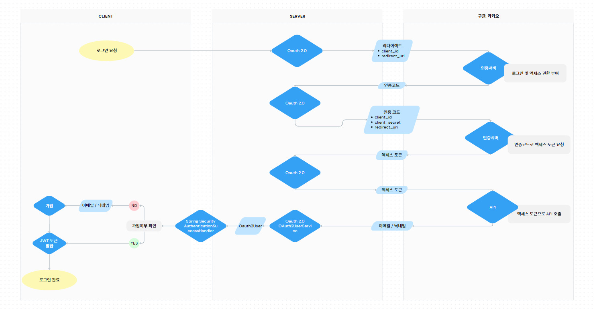
    <br />
    메일 초대
    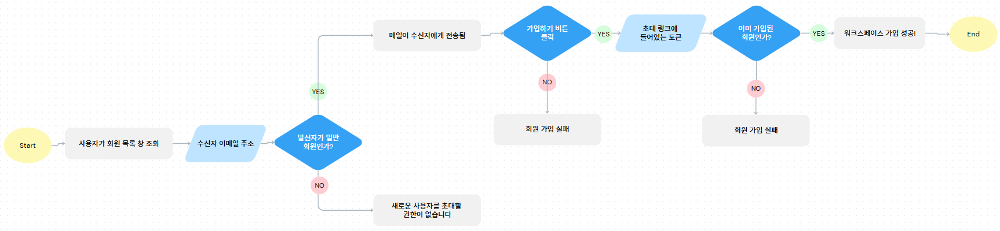
    <br />
    캔버스
    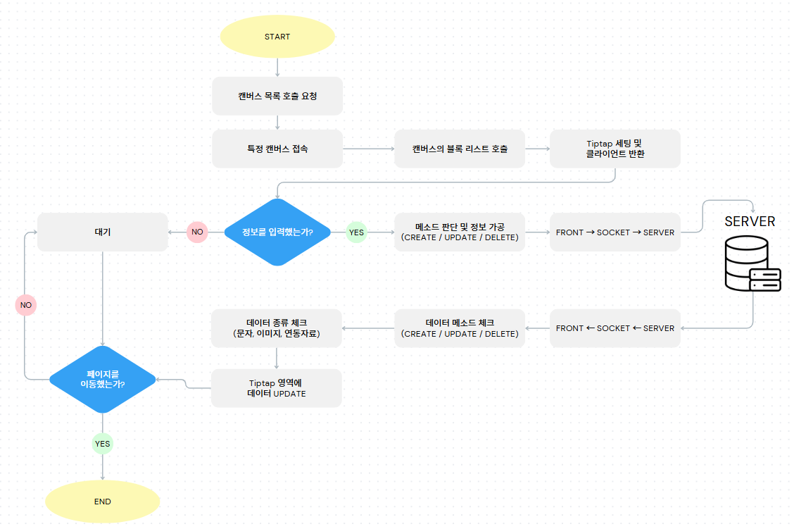
    <br />
    쓰레드 목록
    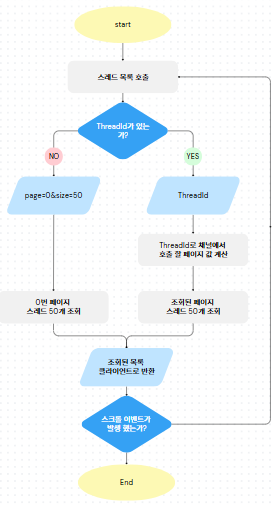
    <br />
    쓰레드 채팅
    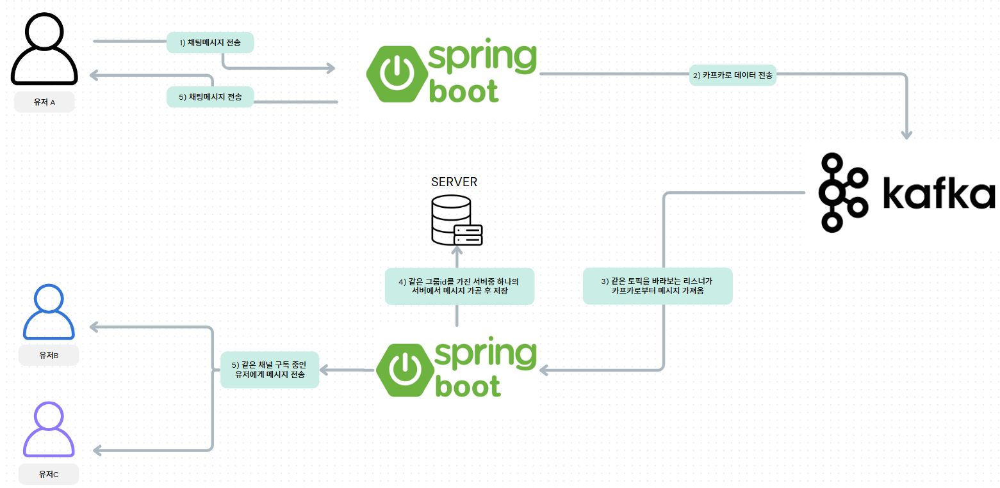
    <br />
    드라이브
    
    <br />
    워크스페이스
    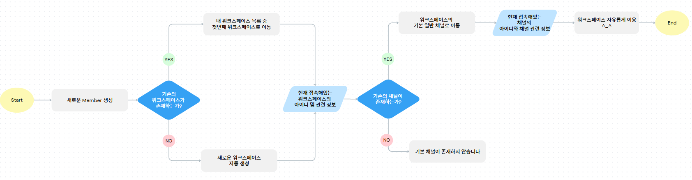
    <br />
    검색
    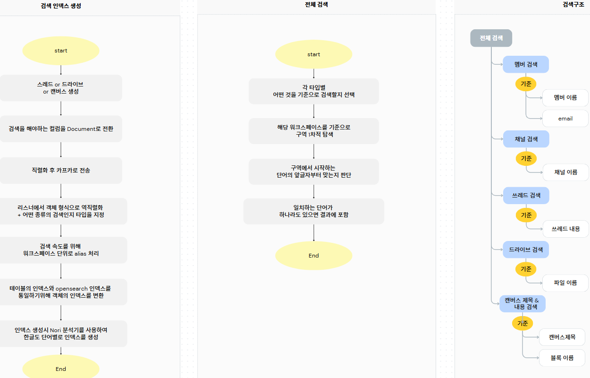
    <br />
    알림
    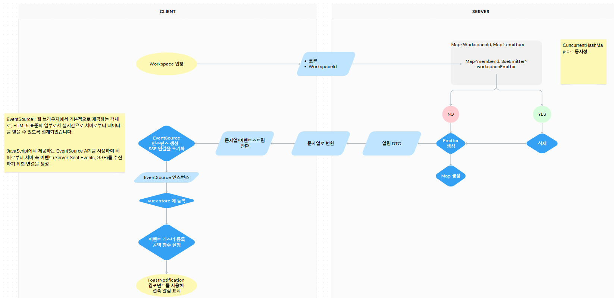
    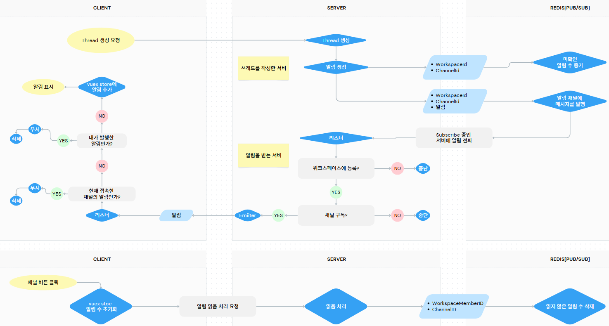

<br /><br />

<h2 id="구조-및-아키텍처"> 구조 및 아키텍처 </h2>
   <a href="https://www.meetup.com/Angular-Medellin/">
    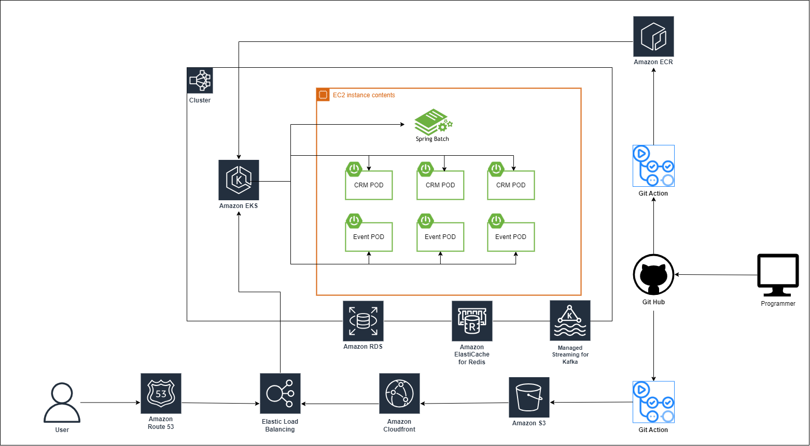
  </a> 
<br /><br />

<h2 id="배포"> 배포 </h2>
    <h3>로그인</h3>
    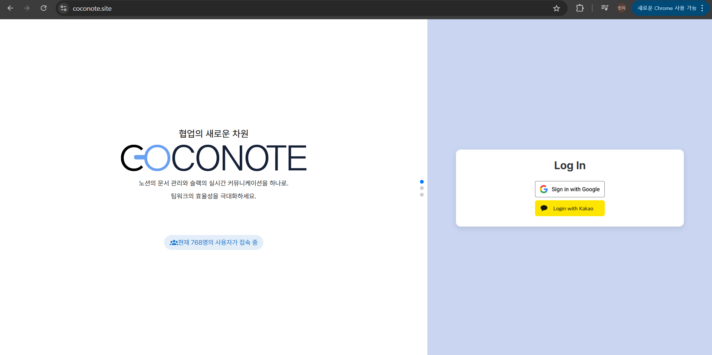
    <h3>쓰레드</h3>
    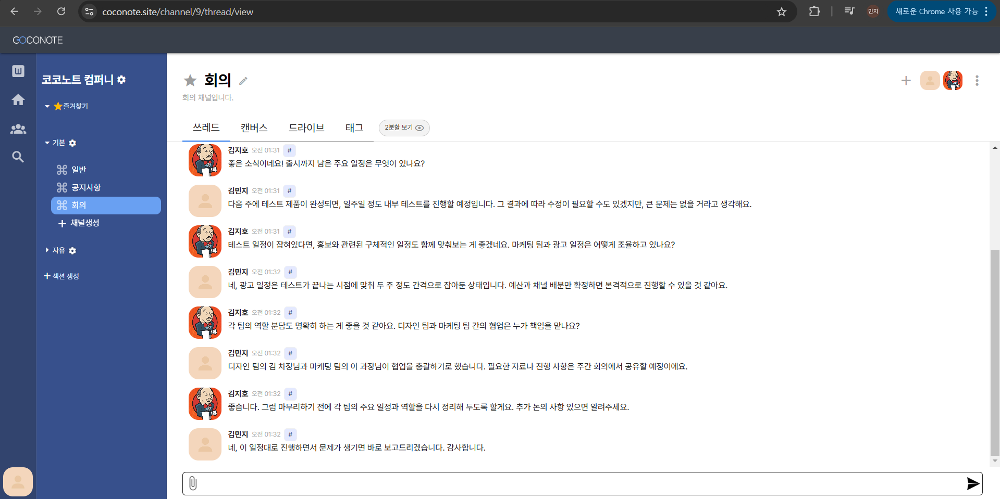
    <h3>캔버스</h3>
    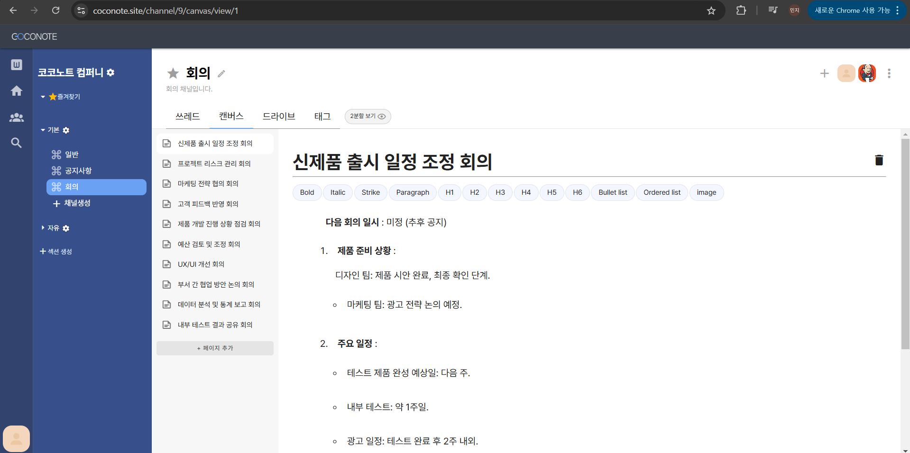
    <h3>드라이브</h3>
    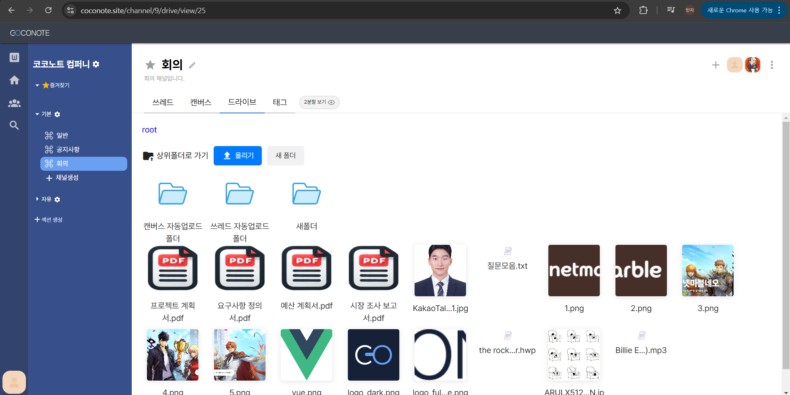
    <h3>2분할</h3>
    
